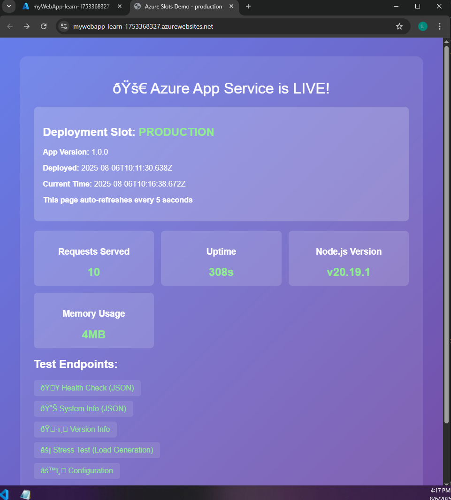
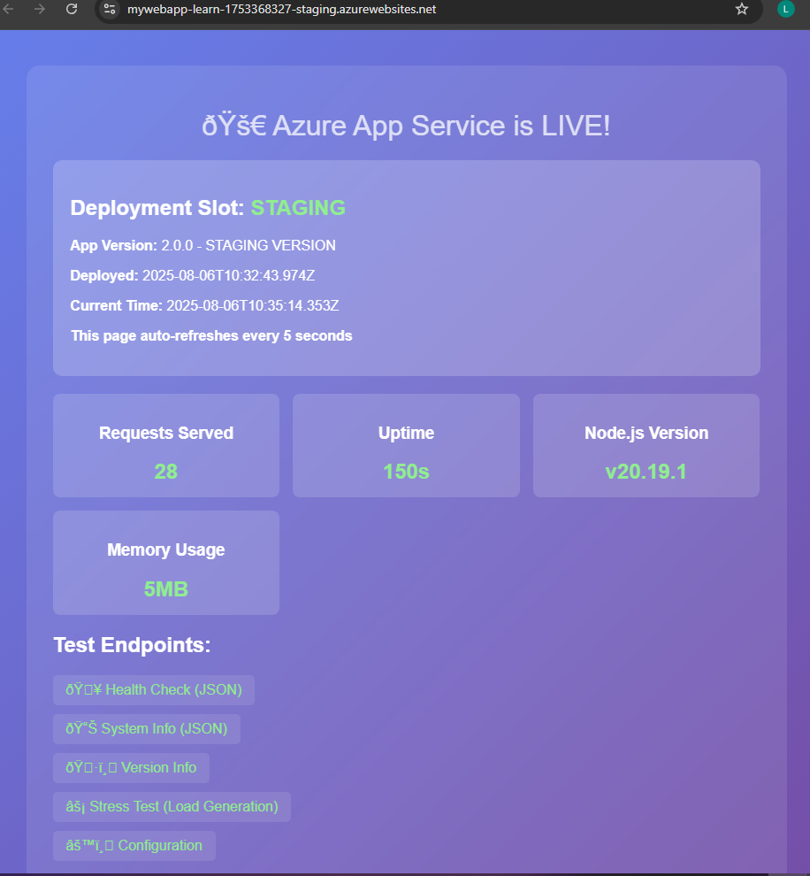
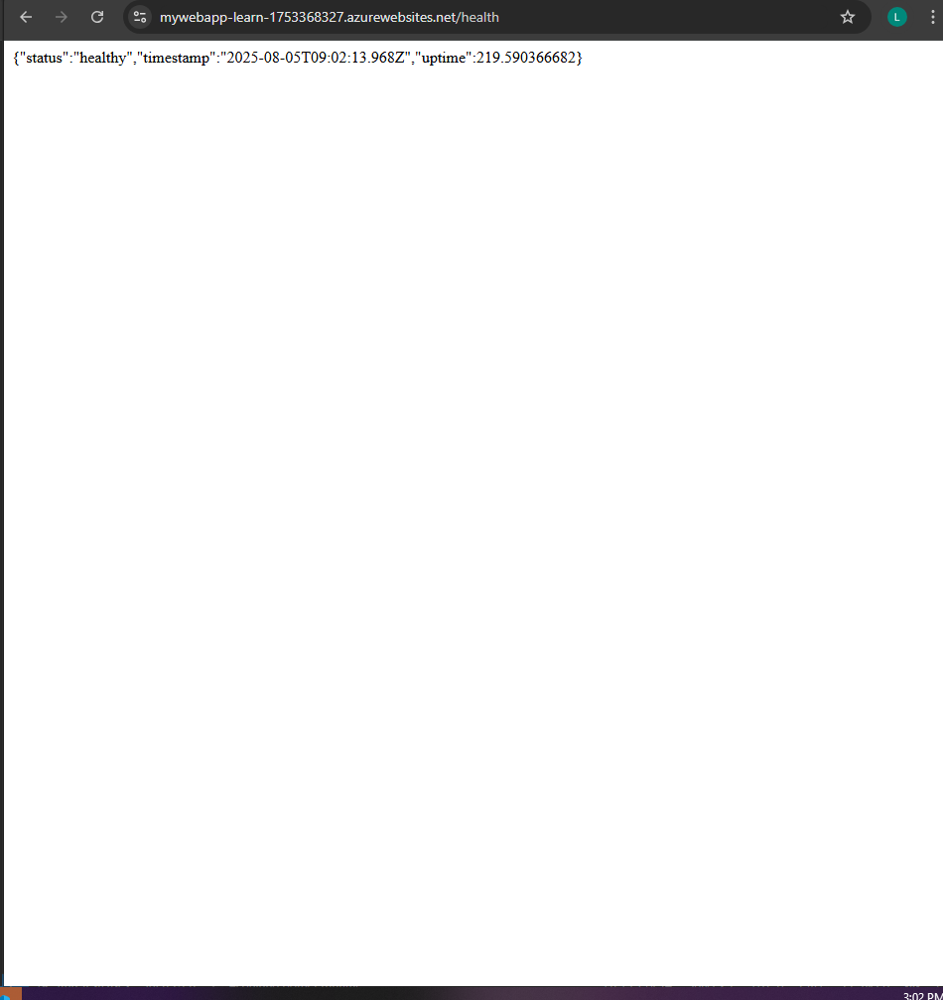
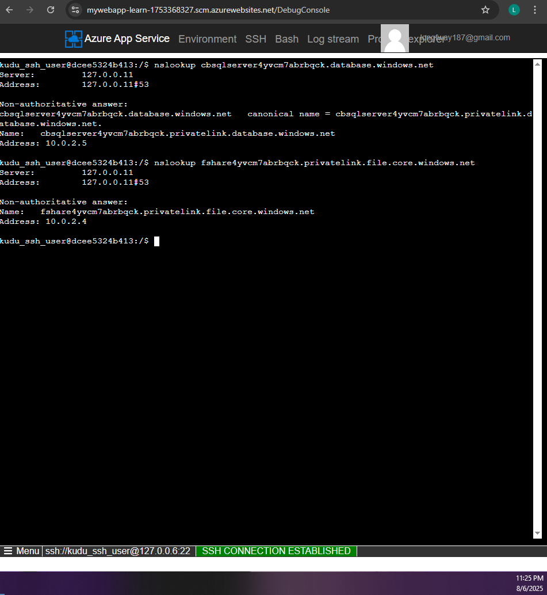
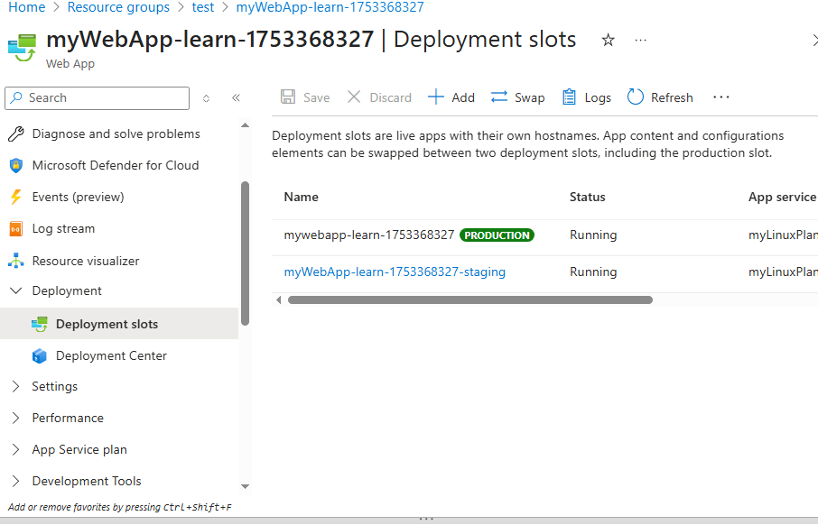

## Azure Private Endpoint Infrastructure with App Service
# 🏗️ Project Overview
This project demonstrates a complete Azure infrastructure setup featuring private endpoints, secure networking, and a Node.js application deployment using Infrastructure as Code (IaC) with Azure Bicep templates.

# 🌟 Key Features
Private Endpoints: Secure connectivity to Azure SQL Database and File Share storage
Network Security: Comprehensive NSG rules and subnet segmentation
App Service: Node.js application with staging slots for blue-green deployments
Infrastructure as Code: Modular Bicep templates for reproducible deployments
Private DNS: Custom DNS zones for private endpoint resolution
# 🏛️ Architecture
┌─────────────────────────────────────────────────────────────┐
│                     Virtual Network (10.0.0.0/16)          │
├─────────────────────────────────────────────────────────────┤
│  App Service Subnet     │  VM Subnet      │  PE Subnet      │
│  (10.0.3.0/24)          │  (10.0.4.0/24)  │  (10.0.2.0/24)  │
│  ┌─────────────────┐    │  ┌─────────┐    │  ┌─────────────┐ │
│  │ App Service     │    │  │Test VM  │    │  │Private      │ │
│  │ + Staging Slot  │    │  │         │    │  │Endpoints    │ │
│  └─────────────────┘    │  └─────────┘    │  └─────────────┘ │
└─────────────────────────────────────────────────────────────┘
                                    │
                    ┌───────────────┼───────────────┐
                    │               │               │
            ┌───────▼─────┐  ┌──────▼──────┐ ┌─────▼─────┐
            │Azure SQL DB │  │File Share   │ │Private DNS│
            │(Private)    │  │Storage      │ │Zones      │
            └─────────────┘  └─────────────┘ └───────────┘
# 📁 Project Structure
├── main.bicep              # Main orchestration template
├── modules/
│   ├── vnet.bicep          # Virtual network and subnets
│   ├── DB.bicep            # SQL Server and database resources
│   └── testVm.bicep        # Test virtual machine
├── .github/
│   └── workflows/
│       └── deploy.yml      # GitHub Actions CI/CD pipeline
├── app/                    # Node.js application source
├── screenshots/            # Deployment and testing evidence
└── README.md              # This file
# 🚀 Deployed Resources
Network Infrastructure
Virtual Network: Segmented subnets for different tiers
Network Security Groups: Granular traffic control
Private DNS Zones: Custom DNS resolution for private endpoints
Data & Storage
Azure SQL Database: Secured with private endpoint connectivity
File Share Storage: Private endpoint enabled for secure file operations
Private Endpoints: Eliminate public internet exposure
Compute & Applications
App Service Plan: Hosting Node.js application
App Service: Production and staging slot configuration
Test VM: Ubuntu-based testing environment
CI/CD Pipeline
GitHub Actions: Automated deployment workflow
Infrastructure Deployment: Bicep templates via GitHub Actions
Application Deployment: Automated app deployment to staging and production slots
#🔧 Deployment Instructions
Prerequisites
bash
# Install Azure CLI
az login
az account set --subscription "your-subscription-id"
Deploy Infrastructure
bash
# Create resource group
az group create --name myResourceGroup --location eastus

# Deploy Bicep template
az deployment group create \
  --resource-group myResourceGroup \
  --template-file main.bicep \
  --parameters pass='YourSecurePassword123!'
Automated Deployment with GitHub Actions
yaml
# The workflow automatically deploys on push to main branch
# See .github/workflows/deploy.yml for full pipeline
git push origin main
# 🧪 Testing & Validation
Private Endpoint Connectivity
✅ SQL Database accessible only through private endpoint
✅ File share connectivity via private network
✅ DNS resolution working for privatelink zones
Application Deployment
✅ Production slot serving application successfully
✅ Staging slot configured for blue-green deployments
✅ Slot swapping functionality verified
Security Validation
✅ Public access disabled on SQL Database
✅ NSG rules preventing unauthorized access
✅ Network segmentation enforced
# 📸 Screenshots & Evidence
Component	Screenshot

Screenshots demonstrate successful deployment and testing of all components

# 🎯 Key Achievements
Zero Public Exposure: All data services accessible only via private endpoints
Automated Deployment: Complete IaC implementation with Bicep + GitHub Actions CI/CD
Production-Ready: Staging slots enable zero-downtime deployments
Secure Networking: Multi-layered security with NSGs and private DNS
Scalable Architecture: Modular design supports easy expansion
DevOps Integration: Full CI/CD pipeline with automated testing and deployment

# 🔮 Future Enhancements
 Add Azure Key Vault for secrets management
 Implement Application Gateway for advanced routing
 Add Azure Monitor and Log Analytics
 Configure auto-scaling policies
 
# 📞 Contact
Feel free to connect with me on LinkedIn to discuss this project or Azure architecture!
https://www.linkedin.com/in/mohammed-zain-661a86215/

This project demonstrates enterprise-grade Azure infrastructure patterns with security-first design principles.

